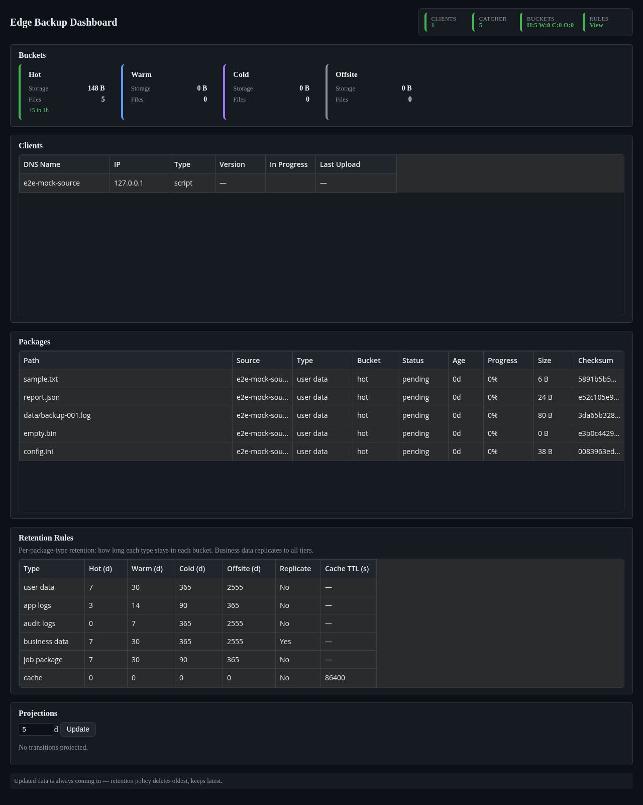
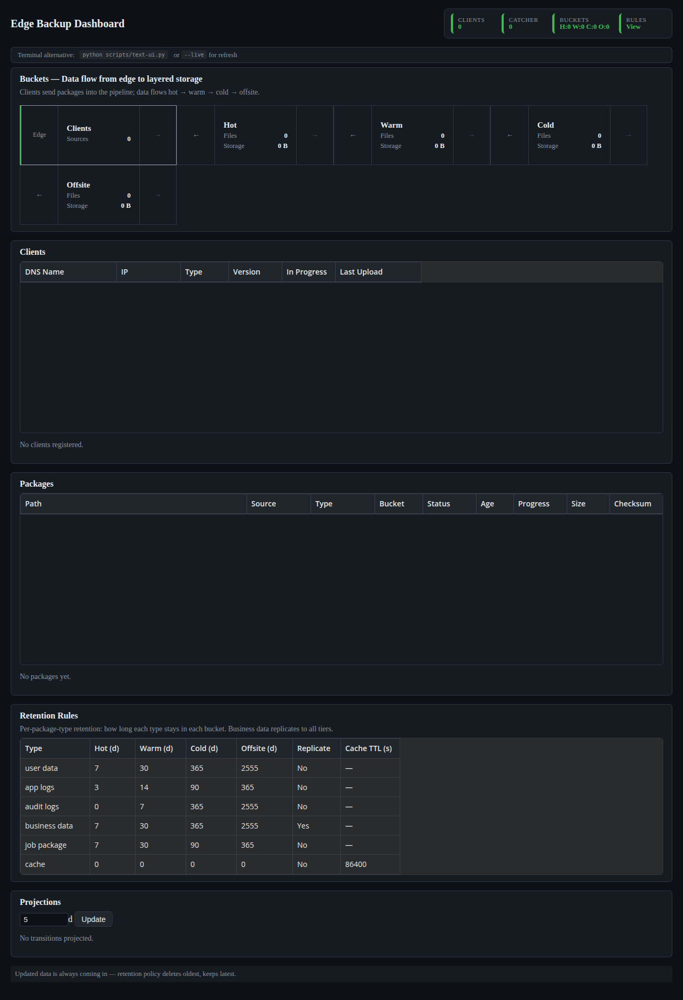

# Edge Backup System

Treat edge devices as **cattle, not pets**: data does not reside on the edge. It is packaged, tracked, and stored in cloud or offsite storage. This repo implements an end-to-end data backup strategy with minimal tooling.

## The Big Picture

| Component | Role | Where it runs |
|-----------|------|---------------|
| **Edge clients** | Watch folders, package data, POST to catcher | On each edge device (Windows, Linux, Docker) |
| **Catcher (backend)** | Receives ingest, applies retention rules, assigns buckets | Central server (cloud VM, on-prem, or container) |
| **Dashboard (frontend)** | Read-only UI: data flow, buckets, rule sets, projections | Same host as catcher or CDN |
| **Storage (Phase 4)** | Hot/warm/cold/offsite tiers | Cloud object storage |

**Data flow:** Sources (edge) → Catcher → Buckets. Rule sets (e.g. "90-day cache → cold") control when data transitions. The dashboard shows streams into buckets, retention config, and projections (which files will move in the next N days). See [docs/DEPLOYMENT.md](docs/DEPLOYMENT.md) for where to deploy each component.

Development is **spec-driven** (OpenSpec) and **task-tracked** (Beads): one source-of-truth spec, phased tasks with dependencies, and a clear workflow for AI and humans.

---

## Project structure

```
bookish-train/
├── openspec/
│   └── specs/
│       └── edge-backup-system.md   # Single source of truth: architecture, API, models
├── .beads/                         # Beads task DB (after bd init); beads.db gitignored
├── scripts/
│   └── beads-setup.sh              # Seed Beads with phased tasks
├── backend/                        # Catcher (FastAPI)
│   ├── main.py
│   ├── requirements.txt
│   └── Dockerfile
├── frontend/                       # Dashboard (Svelte 5, stores for jobs, sources, buckets, config, projections)
│   ├── src/
│   │   ├── App.svelte
│   │   ├── main.js
│   │   └── stores/
│   │       ├── jobs.svelte.js
│   │       ├── sources.svelte.js
│   │       ├── buckets.svelte.js
│   │       ├── config.svelte.js
│   │       └── projections.svelte.js
│   ├── package.json
│   ├── vite.config.js
│   └── Dockerfile
├── clients/
│   └── docker-client/              # Phase 1: container client (watch dir → POST /ingest)
│       ├── watch_and_ingest.py
│       ├── Dockerfile
│       └── test-data/
├── docker-compose.yml              # Phase 1: catcher + client + dashboard
├── tests/                          # Playwright E2E + visual capture
│   ├── e2e/
│   │   └── dashboard.spec.js
│   └── README.md
├── docs/
│   └── VALIDATION-WORKFLOW.md      # Validation workflow, commands, screenshots
├── AGENTS.md                       # How AI agents should use Beads and OpenSpec
└── README.md
```

---

## Running the app

### Option A: Local (no Docker)

**Backend**

```bash
cd backend
python -m venv .venv
source .venv/bin/activate   # Windows: .venv\Scripts\activate
pip install -r requirements.txt
uvicorn main:app --reload --port 8000
```

Or from repo root (avoids "Directory not found" if started from wrong cwd):

```bash
npm run backend
# or: ./scripts/start-backend.sh
```

**Frontend**

```bash
cd frontend
npm install
npm run dev
```

Open http://localhost:5173. The Vite dev server proxies `/api` to `http://localhost:8000`.

**Client (optional)**

```bash
# From repo root, with catcher and optional test dir
export CATCHER_URL=http://localhost:8000
export WATCH_DIR=./clients/docker-client/test-data
python clients/docker-client/watch_and_ingest.py
```

### Option B: Docker (Phase 1 prototype)

```bash
docker compose up --build
```

- Catcher: http://localhost:8000  
- Dashboard: http://localhost:5173  
- Client container watches `clients/docker-client/test-data` and POSTs to the catcher. Add files there to see jobs in the dashboard.

### Populate demo data (see dashboard with jobs)

With catcher and dashboard running:

```bash
python scripts/seed-demo-data.py
```

Then open http://localhost:5173 and click Refresh. Uses `tests/fixtures/mock-data/MANIFEST.json` (5 mock files). Optional: `--source my-source`, `--url http://other:8000`.

### 2-minute demo walkthrough (Client → Catcher → Buckets)

Accelerated retention (30 seconds instead of 90 days) to walk through the full flow:

1. Start backend with demo mode: `DEMO_MODE=1 uvicorn main:app --port 8000` (in `backend/`)
2. Start frontend: `npm run dev` (in `frontend/`)
3. Open dashboard: http://localhost:5173
4. Run: `python scripts/run-demo.py`

The script ingests backup, audit, and cache files over 2 minutes; cache files are deleted after 5s retention; some items are backdated to simulate aging into warm/cold buckets. Watch Component Status, Buckets, Rule Set, and Projections update. See `scripts/demo-config.json` for retention values.

---

## OpenSpec (spec-driven development)

OpenSpec keeps a single source-of-truth spec so humans and AI agree on what to build before coding.

- **Spec file:** `openspec/specs/edge-backup-system.md` — architecture, phases, API endpoints, JSON data models, validation rules.
- **Workflow:** Propose changes in the spec → implement → update Beads when done.

**Install OpenSpec (npm)**

```bash
npm install -g @fission-ai/openspec@latest
cd /path/to/bookish-train
openspec init
```

Then use slash commands in your AI tool (e.g. Cursor): `/opsx:new <feature>`, `/opsx:ff`, `/opsx:apply`, `/opsx:archive`. Our spec is already in `openspec/specs/`; you can point changes at it or create new capability specs.

---

## Beads (progress tracker)

Beads is a git-backed, dependency-aware task tracker. Use it for session memory and to see what work is unblocked.

**Install Beads**

- **macOS / Linux:** `brew install beads` or [quick install script](https://raw.githubusercontent.com/steveyegge/beads/main/scripts/install.sh).
- **Go:** `go install github.com/steveyegge/beads/cmd/bd@latest`
- **Windows:** [PowerShell installer](https://raw.githubusercontent.com/steveyegge/beads/main/install.ps1) or `go install` (see [Beads installation](https://steveyegge.github.io/beads/getting-started/installation)).

**Initialize and seed tasks in this repo**

```bash
./scripts/beads-setup.sh
```

This runs `bd init` and creates phased tasks (Phase 1: backend, routes, frontend, Docker, client script; Phase 2: Windows agent and package; Phase 3/4 placeholders). Add dependencies between tasks with:

```bash
bd dep add <blocked-task-id> <blocker-task-id>
```

**Useful commands**

- **Unblocked work:** `bd ready`
- **List open:** `bd list --status open`
- **List closed (Phase 1 done):** `bd list --status closed`
- **Sync to git:** `bd sync`
- **Cursor integration:** `bd setup cursor` (injects workflow context)

**Seeing Beads updates:** Run `bd sync`, then `git add .beads/issues.jsonl .beads/config.yaml .beads/metadata.json` and commit. The JSONL is the source of truth; commit it to persist progress across sessions and share with collaborators.

For **AI agents:** see `AGENTS.md` for how to use Beads for session memory and task management.

---

## Phases (summary)

| Phase | Scope |
|-------|--------|
| **1** | Docker prototype: catcher API, Svelte dashboard, client container that watches a dir and POSTs to `/api/v1/ingest`. |
| **2** | MVP Windows endpoint: agent that monitors local folders and forwards to catcher; package for deployment. |
| **3** | Additional clients (Linux, macOS) and network filesystem sources. |
| **4** | Cloud storage tiers (hot/warm/cold) and offsite storage. |

Details and API/validation rules are in `openspec/specs/edge-backup-system.md`.  
**Where to deploy:** See [docs/DEPLOYMENT.md](docs/DEPLOYMENT.md).

---

## Validation Tests (Playwright)

Per-phase E2E tests and workflow documentation:

```bash
# Start catcher + dashboard first, then:
npm install
npm run test:e2e
```

→ [docs/VALIDATION-WORKFLOW.md](docs/VALIDATION-WORKFLOW.md) — prerequisites, commands, workflow with screenshots.

**Progress:** Track tasks in [docs/TASKS.md](docs/TASKS.md) or run `./scripts/beads-setup.sh` when Beads is installed.

---

## Screenshots

Dashboard screenshots are captured by Playwright E2E tests. To capture and copy them to `docs/`:

```bash
npx playwright install chromium   # first-time only
npm run capture-screenshots
```




