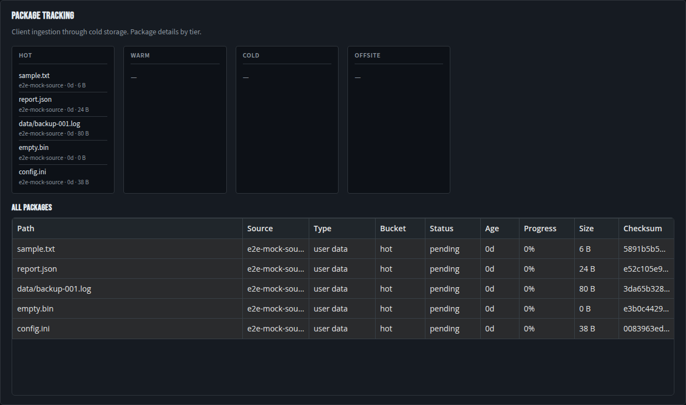
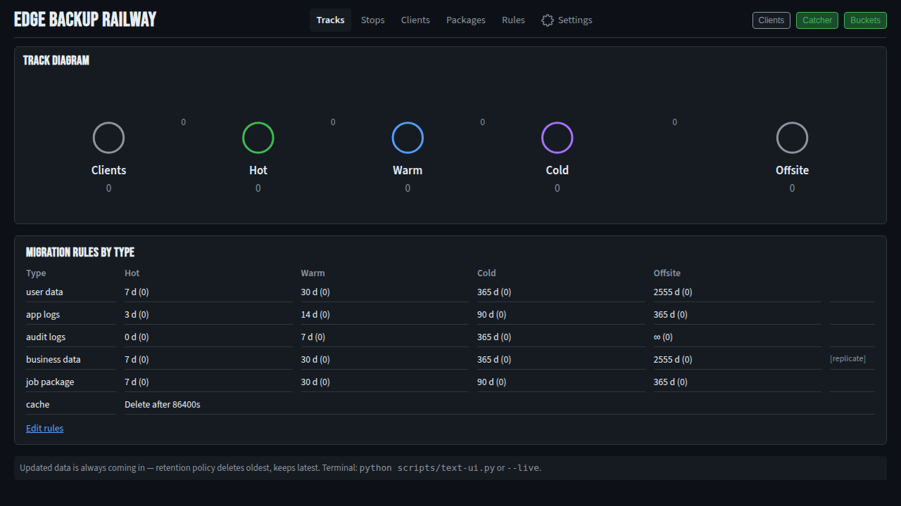

# Edge Backup System

The loss of the Library of Alexandria reminds us how easily a single repository of knowledge can vanish. Today, every organization has its own "library"—data that must survive hardware failure, human error, and disaster. We can copy our books: **restic** and **rclone** make it practical to duplicate and move data across tiers and offsite. But copies alone are not enough. We need to *keep track* and ensure each package continues on its way through a **data migration plan**—implemented by **rulesets** that move data from hot to warm to cold to offsite by age and type. Edge Backup Railway does that: it tracks metadata, applies retention rules, and keeps your library on the right track.

**Treat edge devices as cattle, not pets.** Data does not reside on the edge. It is packaged, tracked, and stored in cloud or offsite storage.

**Railway model:** clients are **engines** that load data into **railcars** and move those railcars to storage **stations/yards**. The API is the **dispatcher**: it tracks manifests, routes, configuration, activity journal, and resume instructions. The web page is the **signal board**: it shows where data is stored and what needs attention. Engines move the payload bytes; the dispatcher and signal board track the work.

**Sharing with friends?** Start with [docs/FRIEND-QUICKSTART.md](docs/FRIEND-QUICKSTART.md). Maintainer notes: [docs/SHARE-PLAN.md](docs/SHARE-PLAN.md).

---

## What We're Building

| Component | Role |
|-----------|------|
| **Catcher** | Central API that tracks backup jobs, sources, buckets, and retention. It does *not* store backup payloads—only metadata. |
| **Edge clients** | Scripts (Python, restic, rclone) that backup data and POST metadata to the Catcher. |
| **Storage** | restic (dedup, integrity) and rclone (tier transfers). Phase 4 integrates S3, GCS, local, etc. |
| **Monitoring** | Web dashboard (Svelte) or Text UI (terminal) show status, buckets, packages, and projections. |

Railway vocabulary for new work:

| Railway term | Existing term | Role |
|--------------|---------------|------|
| Engine | Client / edge client | Moves data to storage. |
| Railcar | Package / file payload | Unit of backup data. |
| Manifest | Package metadata | Checksum, size, type, destination, status. |
| Route | Destination plan | Ordered storage targets. |
| Station / yard | Storage server | TrueNAS, local repo, OneDrive, IDrive e2/S3, restic repository. |
| Dispatcher | Catcher API | Control-plane status, config, resume, journal. |
| Signal board | Web dashboard / text UI | Read-only tracker. |
| Yard ledger | Activity journal | Append-only audit trail. |
| Timetable | Config snapshot | Versioned backup of routes and rules. |

---

## Architecture

```
                    ┌─────────────────────────────────────────────────────────┐
                    │          DISPATCHER / CATCHER API (FastAPI)              │
                    │  Tracks: manifests, routes, status, config, journal      │
                    │  APIs: POST /ingest, PATCH /packages, GET /status, etc.  │
                    └──────────────────────────┬──────────────────────────────┘
                                               │
         ┌─────────────────────────────────────┼─────────────────────────────────────┐
         │                                     │                                     │
         ▼                                     ▼                                     ▼
┌─────────────────┐               ┌─────────────────────┐               ┌─────────────────────┐
│  ENGINES        │               │   STATIONS/YARDS    │               │   SIGNAL BOARD      │
│  - watch dir    │  metadata     │   (actual storage)  │  GET /status  │   - Web Dashboard   │
│  - restic       │ ─────────────►│   - TrueNAS/local   │ ◄─────────────│   - Text UI         │
│  - rclone       │  PATCH prog   │   - OneDrive/S3     │               │     (--live)        │
└─────────────────┘               └─────────────────────┘               └─────────────────────┘
```

The API/web layer is decoupled from data movement. Clients/engines copy data to storage stations and report manifests/status to the dispatcher. The dispatcher can tell an engine what to resume after an error, but it does not move the user's payload bytes.

See [`docs/RAILWAY-ARCHITECTURE.md`](docs/RAILWAY-ARCHITECTURE.md) for the canonical vocabulary, resume model, configuration backup, and activity journal plan.

For home-use reliability and ransomware safety, see [`docs/HOME-RELIABILITY-RANSOMWARE.md`](docs/HOME-RELIABILITY-RANSOMWARE.md) and [`docs/RANSOMWARE-README.md`](docs/RANSOMWARE-README.md). The system should be safe by default: no public dashboard, no destructive sync by default, append-only/immutable recovery points, panic brake for suspicious mass changes, canary files, and passkey/manual unlock for sensitive actions.

---

## Data Flow (with screenshots)

Data flows **Clients → Hot → Warm → Cold → Offsite**. Retention rules (per package type) determine when packages transition between tiers. The dashboard visualizes this as a train: each car is a bucket, with incoming and outgoing package counts.

### 1. Web Dashboard — Data Flow View



*Clients (sources) send packages into Hot; packages age and move Warm → Cold → Offsite per retention rules.*

### 2. Web Dashboard — Empty State



*Component status, buckets, packages, clients, retention rules, and projections.*

### 3. Text UI — Terminal Monitoring


*Same data in the terminal. Use `python scripts/text-ui.py --live` to watch uploads in real time.*

### 4. AI terminals, logs, and SigNoz observability

Backup engines and the dispatcher emit **structured JSON logs** (for [SigNoz](https://signoz.io)) and **`EBK` status lines** for [Chaterm](https://chaterm.ai)-style AI terminals and OpenClaw agents.

**Run the observability demo** (no Catcher required):

```bash
python scripts/demo-observability.py
python scripts/demo-observability.py --write-samples   # refresh docs/samples/
```

**Sample output checked into the repo** (point agents at these files):

| File | Purpose |
|------|---------|
| [`docs/samples/agent-logs-sample.jsonl`](docs/samples/agent-logs-sample.jsonl) | Example JSON log lines (`event_type`, `error_source`, `operation`) |
| [`docs/samples/agent-ebk-sample.txt`](docs/samples/agent-ebk-sample.txt) | Example `EBK` tab-separated status lines |
| [`docs/samples/agent-log-guide.md`](docs/samples/agent-log-guide.md) | Short guide for parsing logs |

**Example JSON log** (transfer failure — note `error_source` and `operation`):

```json
{"severity":"ERROR","event_type":"transfer_failed","error_source":"home-backup-chain-demo","operation":"copy_hop","error_message":"checksum mismatch for ...","source_id":"demo-home-client","station_id":"google-drive"}
```

**Example EBK line** (grep-friendly for terminals):

```
EBK	command=error	error_source=home-backup-chain-demo	operation=copy_hop	event_type=transfer_failed	error_message=checksum mismatch ...
```

**Agent commands** (live dispatcher):

```bash
python scripts/backup-agent.py commands --format ai
python scripts/backup-agent.py status --format ai
python scripts/text-ui.py --format ai
```

Environment: `EBK_LOG_FORMAT=json`, `EBK_AI_STATUS=1`, optional `OTEL_EXPORTER_OTLP_ENDPOINT` for SigNoz. Full details: [`docs/OBSERVABILITY-SIGNOZ.md`](docs/OBSERVABILITY-SIGNOZ.md).

---

## API Reference

Base path: `http://localhost:8000/api/v1` (or `CATCHER_URL`).

| Method | Path | Purpose |
|--------|------|---------|
| `POST` | `/ingest` | Register a backup job. Body: `{ "source_id", "path", "checksum?", "size_bytes?", "package_type?" }`. Returns `{ "job_id" }`. |
| `PATCH` | `/packages/{id}` | Update progress or status. Body: `{ "progress_percent?", "checksum?", "status?" }`. |
| `GET` | `/packages` | List packages. Query: `?status=`, `?source_id=`, `?bucket=`. |
| `GET` | `/packages/{id}` | Get one package. |
| `GET` | `/sources` | List registered sources. |
| `POST` | `/sources` | Register source: `{ "source_id", "label?" }`. |
| `GET` | `/buckets` | Bucket counts and storage per tier. |
| `GET` | `/config` | Retention rule sets (hot/warm/cold/offsite per package type). |
| `GET` | `/projections` | Upcoming transitions: `?days=5` or `?seconds=10` (demo). |
| `GET` | `/status` | Component status (clients, catcher, buckets). |

**Ingest body (POST /ingest):**

```json
{
  "source_id": "my-laptop",
  "path": "backup/2024-01/data",
  "checksum": "sha256-hex (required when size_bytes > 0)",
  "size_bytes": 1024000,
  "package_type": "user_data | app_logs | audit_logs | business_data | job_package | cache"
}
```

**Package patch body (PATCH /packages/{id}):**

```json
{ "progress_percent": 75, "status": "in_progress" }
{ "progress_percent": 100, "checksum": "sha256...", "status": "completed" }
```

---

## Restic & Rclone Prototype

Per [OpenSpec §2.3](openspec/specs/edge-backup-system.md): **rclone** for 7z-compressed tier transfers; **restic** for full replicated backups. A prototype script reports backup progress to the Catcher:

```bash
# Install
pip install requests

# Mock mode (no restic/rclone) — simulates 0–100% over 10 seconds
python scripts/restic-rclone-backup.py --mock --path backup/demo

# Restic (requires RESTIC_REPOSITORY)
export RESTIC_REPOSITORY=s3:s3.amazonaws.com/my-bucket
python scripts/restic-rclone-backup.py --tool restic --path /data/to/backup

# Rclone (requires rclone configured)
python scripts/restic-rclone-backup.py --tool rclone --from /local/path --to remote:bucket/path
```

The script:
1. `POST /ingest` — registers the job
2. Runs restic backup or rclone copy
3. `PATCH /packages/{id}` — updates `progress_percent` during transfer
4. `PATCH /packages/{id}` — sets `status=completed` when done

---

## Local Provider-Chain Demo

To demonstrate a home backup path without real cloud credentials, run the local provider-chain demo:

```bash
# Filesystem-only validation
python3 scripts/home-backup-chain-demo.py --no-catcher

# Optional: start Catcher first, then report each hop to the dashboard/text UI
cd backend && uvicorn main:app --port 8000
CATCHER_URL=http://127.0.0.1:8000 python3 scripts/home-backup-chain-demo.py
```

The script creates sample home-client data, packages it, then copies and verifies:

```text
home-client -> local-nas -> google-drive -> backup-service
```

All provider targets are local directories under `/tmp/edge-backup-home-chain` by default. The generated `MANIFEST.json` records the package checksum and every verified hop. This is a demo of the planned NAS/cloud/offsite flow; production provider access remains a Phase 4 rclone/restic configuration task.

The home client also keeps an append-only local transfer log at `home-client/transfer-log.jsonl`. It records package creation, each transfer attempt, destination, checksum, size, Catcher job id when available, and verification status. Use it to audit what was sent or to resend missing/corrupt provider copies:

```bash
# Recreate any missing/corrupt NAS, Google Drive, or backup-service copy
python3 scripts/home-backup-chain-demo.py --no-catcher --reuse --resend-from-log
```

---

## Monitoring Uploads with the Text UI

Run the backup in one terminal and the Text UI in another:

```bash
# Terminal 1: Start catcher and run a mock backup
cd backend && uvicorn main:app --port 8000 &
python scripts/restic-rclone-backup.py --mock --path backup/demo --duration 15

# Terminal 2: Watch progress live
python scripts/text-ui.py --live
```

The Text UI refreshes every 3 seconds (or `--refresh 5`). Packages show status (`in_progress`), `progress_percent`, and move to `completed` when done.

---

## Client Text UI and Package Types

The Python watch client can also render a local text display while it scans files and registers packages with Catcher:

```bash
export CATCHER_URL=http://127.0.0.1:8000
export WATCH_DIR=/tmp/edge-client-samples
export SOURCE_ID=my-laptop
export CLIENT_TEXT_UI=1
python clients/docker-client/watch_and_ingest.py
```

The display tracks each observed file through local stages such as `hashing`, `registering`, `in_progress`, `completed`, `failed`, or `skipped`. It also shows the inferred `package_type`, size, progress, Catcher job id, and checksum prefix.

Sample files to try:

```bash
mkdir -p /tmp/edge-client-samples/{Documents,logs,audit,.cache,exports}
printf 'family photos index\n' > /tmp/edge-client-samples/Documents/photos.txt
printf 'INFO app started\n' > /tmp/edge-client-samples/logs/app.log
printf '{"event":"login"}\n' > /tmp/edge-client-samples/audit/login-audit.json
printf 'id,total\n1,42\n' > /tmp/edge-client-samples/exports/orders.csv
printf 'temporary bytes\n' > /tmp/edge-client-samples/.cache/session.tmp
tar -czf /tmp/edge-client-samples/exports/site-package.tar.gz -C /tmp/edge-client-samples Documents
```

Default classification examples:

| Sample path | Package type |
|-------------|--------------|
| `Documents/photos.txt` | `user_data` |
| `logs/app.log` | `app_logs` |
| `audit/login-audit.json` | `audit_logs` |
| `exports/orders.csv` | `business_data` |
| `.cache/session.tmp` | `cache` |
| `exports/site-package.tar.gz` | `job_package` |

Set `DEFAULT_PACKAGE_TYPE=business_data` to change the fallback type for unrecognized extensions.

For a full local + S3-style repository upload demo, see [`clients/docker-client/README.md`](clients/docker-client/README.md):

```bash
python3 scripts/client-repository-demo.py
```

---

## Quick Start

Copy [`.env.example`](.env.example) to `.env` if you want local overrides.

**Backend**

```bash
cd backend && pip install -r requirements.txt && uvicorn main:app --port 8000
```

**Frontend**

```bash
cd frontend && npm install && npm run dev
```

Open http://localhost:5173.

**Text UI (terminal alternative)**

```bash
pip install -r scripts/requirements-text-ui.txt
python scripts/text-ui.py              # One-shot
python scripts/text-ui.py --live      # Live refresh
```

**Seed demo data**

```bash
python scripts/seed-demo-data.py
```

**Containers (Podman or Docker)**

```bash
./scripts/up.sh                    # Recommended: fresh dashboard build, latest UI
# Or: ./scripts/container-compose.sh -f docker-compose.yml up -d --build
# Phase 1 assessment (stack + scenario): ./scripts/phase1-assess.sh
```

**Client options:**
- `client` — Metadata-only: watches dir, POSTs to Catcher (no storage).
- `restic-client` — Real backup: restic → MinIO (S3), reports progress to Catcher. Requires `minio` service.
- Run both, or choose: `docker compose up catcher client` (metadata) or `docker compose up catcher minio restic-client` (restic).

---

## Project Structure

```
├── backend/           # Catcher (FastAPI)
├── frontend/          # Web dashboard (Svelte)
├── clients/
│   ├── docker-client/   # Metadata-only (watch + POST); see docker-client/README.md
│   └── restic-client/   # Restic backup → MinIO, report to Catcher
├── scripts/
│   ├── text-ui.py              # Terminal UI (--live for monitoring)
│   ├── restic-rclone-backup.py # Restic/rclone → Catcher prototype
│   ├── client-repository-demo.py # Client text UI local + S3-style repository demo
│   ├── home-backup-chain-demo.py # Local home → NAS → cloud/offsite demo
│   ├── seed-demo-data.py
│   └── run-demo.py
├── docs/              # Screenshots, deployment
└── openspec/specs/    # edge-backup-system.md (single source of truth)
```

---

## Phases

| Phase | Scope |
|-------|--------|
| **1** | Catcher API, Svelte dashboard, Text UI, Docker client |
| **2** | Windows endpoint agent |
| **3** | Linux/macOS, NFS sources |
| **4** | Cloud storage tiers; rclone (7z transfers); restic (replicated backups) |

---

## Screenshots

To refresh screenshots:

```bash
npx playwright install chromium
npm run capture-screenshots
python scripts/text-ui.py --save-svg docs/text-ui.svg
```

---

## Development

- **OpenSpec:** `openspec/specs/edge-backup-system.md` — propose changes there first.
- **Beads:** `./scripts/beads-setup.sh` — task tracking.
- **Personal computer MVP:** `docs/PERSONAL-COMPUTER-MVP.md` — executable effort and Beads task path.
- **Railway architecture:** `docs/RAILWAY-ARCHITECTURE.md` — train metaphor, control-plane/data-plane split, resume, journal, and config snapshots.
- **Containers:** `docs/CONTAINER-SETUP.md` — dispatcher API and Signal Board setup with Docker/Podman.
- **Home safety:** `docs/HOME-RELIABILITY-RANSOMWARE.md` and `docs/RANSOMWARE-README.md` — reliability, ransomware protection, canary files, and passkey/fail-safe strategy.
- **Validation:** `npm run verify` — smoke + Playwright; `npm run test:e2e` — e2e only; `./scripts/phase1-scenario.sh` — API workflow on host; `./scripts/phase1-assess.sh` — Phase 1 in containers (Podman or Docker).

See [docs/VALIDATION-WORKFLOW.md](docs/VALIDATION-WORKFLOW.md) and [docs/DEPLOYMENT.md](docs/DEPLOYMENT.md).
