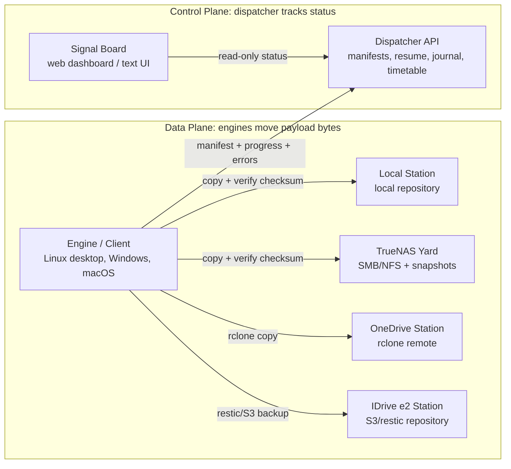
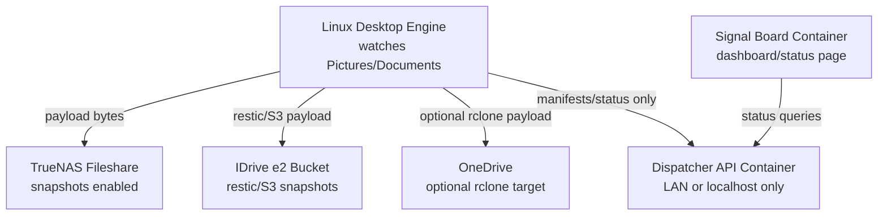
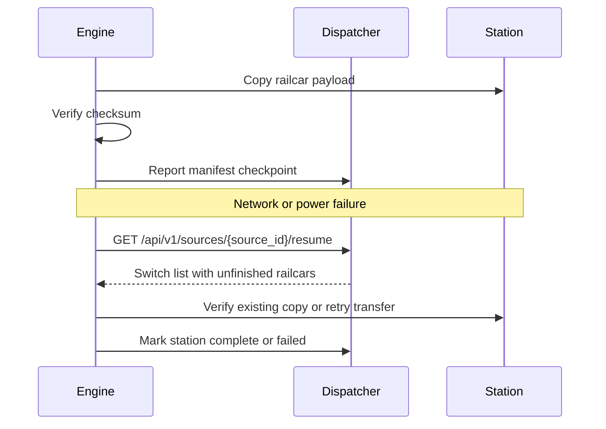
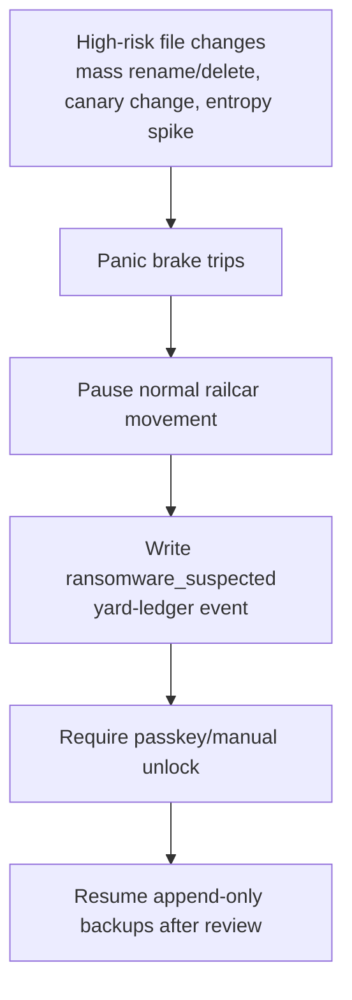

# Edge Backup Railway Architecture

This project uses a railway metaphor for both product language and implementation concepts. The goal is to make the system easy to reason about: clients load trains with information, move them over rails, and report where each car is stored.

## Vocabulary

| Railway term | Software concept | Responsibility |
|--------------|------------------|----------------|
| **Engine** | Client running on a personal computer or server | Moves data. Watches files, builds packages, copies to destinations, verifies checksums, and reports status. |
| **Railcar** | Backup package or file payload | Unit of data being moved. |
| **Consist** | Group of railcars for one run | A backup run that may include many files/package types. |
| **Manifest** | Package metadata | Path, package type, size, checksum, destination, status, timestamps, and resume token. |
| **Route** | Configured destination plan | Ordered destinations such as local repository, TrueNAS, OneDrive, IDrive e2/S3, or restic repository. |
| **Station / Yard** | Storage destination | Where data is actually stored. Examples: local repo, TrueNAS share, S3 bucket, OneDrive remote, IDrive e2 bucket. |
| **Dispatcher** | API backend formerly called Catcher | Control plane. Tracks manifests, routes, status, configuration, resume instructions, and activity journal. It does not move payload bytes. |
| **Signal Board** | Web dashboard / text UI | Read-only operations view over dispatcher state: trains, cars, stations, errors, and resume status. |
| **Switch list** | Resume/work queue from the dispatcher | Instructions an engine uses after restart or failure to continue unfinished railcars. |
| **Yard ledger** | Append-only activity journal | Durable audit trail of config changes, client reports, route changes, transfer attempts, verification, failures, and resumes. |
| **Timetable** | Versioned configuration snapshot | Backup of routes, retention rules, destination definitions, and client defaults. |

## Control plane vs data plane

The architecture is intentionally decoupled.



```text
DATA PLANE
  Engine/client
    -> local repo / TrueNAS / OneDrive / IDrive e2 / S3 / restic repo
    -> verifies checksums at the storage station

CONTROL PLANE
  Engine/client
    -> Dispatcher API: manifest, progress, destination status, checksum, errors
  Signal Board/webpage
    -> Dispatcher API: read status, routes, journal, resume work
```

Rules:

1. Engines move payload data. The dispatcher API does not copy user files between destinations.
2. Engines verify data before marking a railcar complete.
3. The dispatcher records where data is stored, what checksum was verified, and what remains unfinished.
4. The Signal Board reads dispatcher state; it does not talk directly to storage stations for normal status.
5. Storage stations are independent. A local repo can succeed while S3 fails; each destination gets its own manifest/status.

## Daily home network deployment



## Safe-by-default home posture

The railway is designed for personal data first. The dispatcher and Signal Board must not expose a convenient map of family files to anyone on the network.

Defaults:

- bind services to localhost or trusted LAN only
- require unlock before revealing full paths, route details, station URIs, or journal exports
- redact sensitive path/station details in locked views
- allow engines to keep writing append-only recovery points even when the dashboard is locked
- require manual/passkey unlock for route changes, destructive retention actions, and panic-brake resume

## Resume model

Every railcar movement needs enough metadata for an engine to resume safely:

- stable `manifest_id` / resume token
- `source_id` (engine)
- source path and package type
- destination station id and display URI
- size and checksum
- current state: queued, loading, in_transit, verified, registered, complete, failed
- last successful checkpoint
- retry count and last error
- timestamps for created, updated, completed

After a client restart or failure, the engine asks the dispatcher for its switch list:

```text
GET /api/v1/sources/{source_id}/resume
```

The response should include unfinished railcars and enough checkpoint data to decide whether to skip, verify, retry, or mark failed. Clients remain authoritative for actual file movement and checksum verification.

Current prototype endpoint:

```http
GET /api/v1/sources/{source_id}/resume
```

It returns unfinished package manifests with station id, expected checksum/size, status, checkpoint, retry count, and last error.



## Panic brake

Ransomware can turn a normal engine into a bad engine that attempts to move encrypted or deleted data everywhere. Engines should detect suspicious mass changes and stop normal movement before damaging recovery points.

Panic brake triggers include:

- high change volume in a short time
- many deletes or renames
- canary file changes
- many unknown/encrypted-looking extensions
- sudden suspicious entropy changes across personal files

When tripped, the engine reports `stopped_for_safety` to the dispatcher, writes a yard-ledger event, and waits for passkey/manual unlock before resuming.



## Configuration backup

Configuration is operationally important and must not exist only in process memory.

The dispatcher should keep versioned timetable snapshots for:

- route definitions
- storage station definitions
- retention rules
- package type policies
- client defaults
- dashboard-visible labels

Minimum operations:

- create snapshot after every config change
- export config snapshot to JSON
- restore config from a selected snapshot
- show current config version/hash in the Signal Board
- include config changes in the yard ledger

Current prototype endpoints:

```http
GET  /api/v1/config/snapshots
POST /api/v1/config/snapshots
GET  /api/v1/config/snapshots/{snapshot_id}
GET  /api/v1/config/export
POST /api/v1/config/restore/{snapshot_id}
```

## Activity journal

The yard ledger is append-only. It should record:

- client registration
- route/config changes
- package manifest creation
- transfer started/completed/failed
- checksum verified/mismatch
- resume requested
- retry scheduled
- config snapshot/export/restore
- panic brake triggered/cleared
- sensitive view unlocked
- destructive action requested/approved/denied

Journal records should include:

- event id
- timestamp
- actor/source
- event type
- related manifest/package id
- destination/station id when applicable
- before/after status where applicable
- checksum/hash where applicable
- error details when applicable

The journal should be exportable for backup and troubleshooting.

Current prototype endpoints:

```http
GET /api/v1/journal
GET /api/v1/journal/export
```

## Passkey / fail-safe

Home users need a simple fail-safe, not an enterprise identity system.

Sensitive actions should require a local passkey/passphrase gate first, with a path to WebAuthn/passkeys later:

- reveal full file paths and station URIs
- change routes or station definitions
- resume after panic brake
- export full journal
- restore timetable/config snapshots
- delete or expire recovery history

If the passkey is unavailable, engines may continue safe append-only backups, but destructive or revealing actions stay locked.

## Naming guidance for code

New code should prefer railway names where it does not break existing API compatibility:

- `engine` for client-side data movement code
- `manifest` for package metadata
- `route` for destination plan
- `station` for storage destination
- `dispatcher` for API/control-plane internals
- `signal_board` or `dashboard` for UI
- `journal` for append-only event records
- `timetable` for versioned configuration snapshots

Existing public endpoints can keep `/packages`, `/sources`, and `/buckets` until compatibility work is planned. New fields and internal modules should move toward the railway vocabulary.
