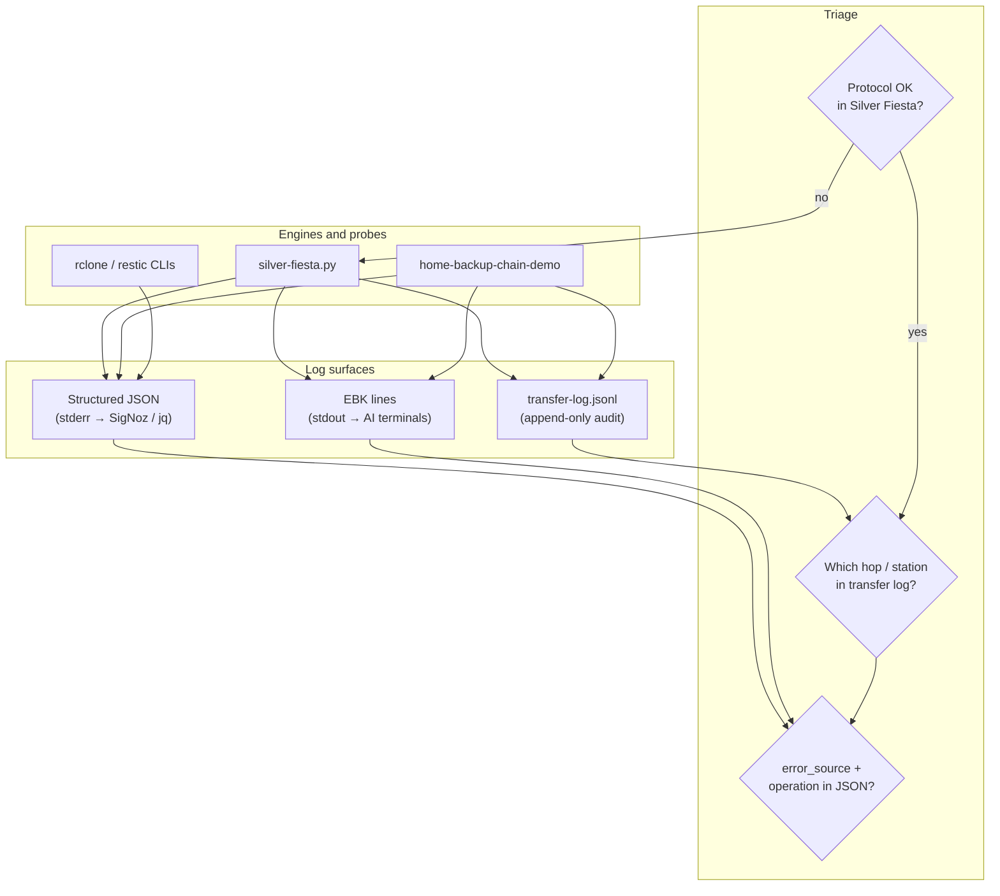
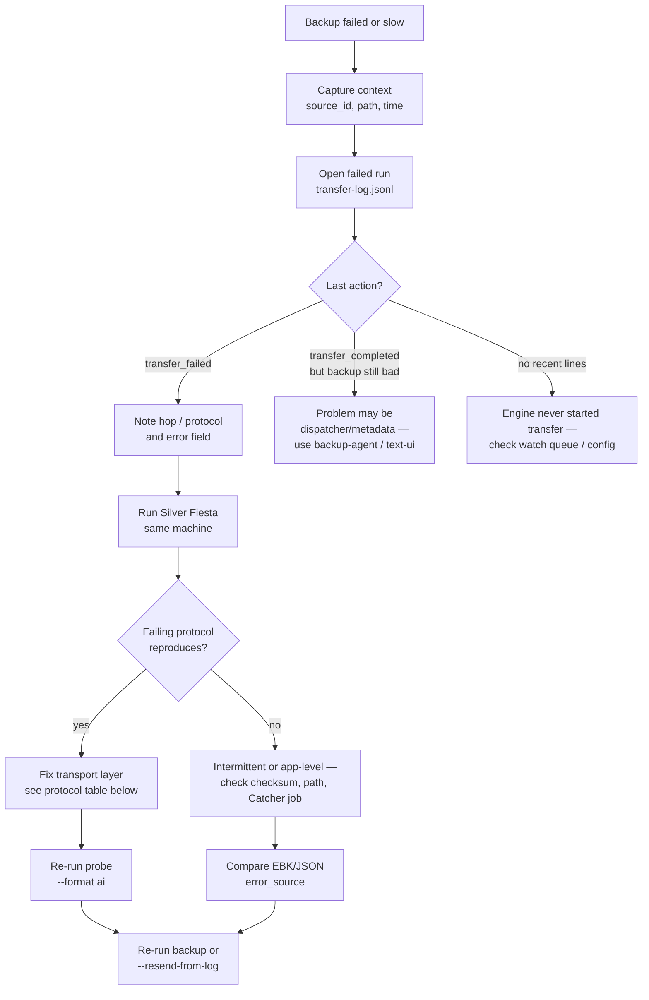

# Transfer protocol troubleshooting (Silver Fiesta)

This guide connects **protocol validation** (`scripts/silver-fiesta.py`), **real backup runs** (`home-backup-chain-demo`, engines, rclone/restic), and the **three log surfaces** agents and humans use together.

## Why shipping felt light

Today’s automated checks mostly prove the harness runs, not that every protocol path is healthy in your environment:

| Check today | What it proves | What it does *not* prove |
|-------------|----------------|---------------------------|
| `test_silver_fiesta.py` (3 tests) | `local_chunked` works; simulated failure writes `transfer_failed`; EBK lines emit | rclone/restic installed; NFS containers; real NAS latency |
| `test_silver_fiesta_transport.py` | Fake `rclone`/`restic` in `PATH`; smoke + transfer + `--doctor` report dir | Real cloud remotes; NFS container run |
| `verify.sh` silver-fiesta block | One `local_chunked` probe + JSON summary | Optional protocols, NFS full suite |
| `demo-observability.py` samples | Dispatcher/client log *shape* | Silver Fiesta `error_source` or per-protocol perf fields |

**Recommended before ship** (pick by destination):

1. **Baseline (CI / every PR):** `python3 scripts/silver-fiesta.py --protocol local_chunked --format json`
2. **Workstation pre-flight:** `python3 scripts/silver-fiesta.py` (auto: chunked + rsync/rclone/restic if installed)
3. **NAS / NFS target:** `python3 scripts/silver-fiesta.py --nfs-smoke` then, when modules loaded, `--protocol nfs_full`
4. **After a failed backup:** same commands + compare `transfer-log.jsonl` from the failed run (see workflow below)
5. **On incident (one command):** `./scripts/protocol-doctor.sh` — writes `/tmp/edge-backup-doctor-<timestamp>/` with `doctor.jsonl`, `doctor.ebk`, `transfer-log.jsonl`, `summary.json`

Regenerate reference samples: `python3 scripts/write-silver-fiesta-samples.py`

### Smoke vs full probes (parity with NFS)

| Tier | NFS | rclone | restic |
|------|-----|--------|--------|
| **Smoke** (fast) | `nfs_smoke` — compose + pytest collect in [silver-fiesta](https://github.com/mowgli42/silver-fiesta) repo | `rclone_smoke` — `rclone version` | `restic_smoke` — `restic version` |
| **Transfer** | `nfs_full` — `make test-lightweight` in external repo | `rclone` — local copy + checksum | `restic` — init/backup/check temp repo |

`--doctor` runs smoke + transfer for rclone/restic and `nfs_smoke` when the external repo is cloned. Add `--nfs-full` to doctor via `./scripts/protocol-doctor.sh --nfs-full`.

---

## Three log surfaces (same incident, three views)



| Surface | Location | Best for |
|---------|----------|----------|
| **transfer-log.jsonl** | `<workspace>/client/transfer-log.jsonl` (Silver Fiesta) or `home-client/transfer-log.jsonl` (chain demo) | Resend, audit trail, per-hop checksums and **performance** (`duration_ms`, `throughput_mib_s`) |
| **Structured JSON** | stderr when `EBK_LOG_FORMAT=json` | SigNoz, `jq`, filtering by `event_type`, `error_source`, `operation` |
| **EBK** | stdout when `EBK_AI_STATUS=1` | `grep '^EBK'`, Chaterm/OpenClaw parsers (`command=protocol_probe`, tab-separated `key=value`) |

---

## Troubleshooting workflow



### Step-by-step

1. **Find the failed hop** in the backup `transfer-log.jsonl`:
   ```bash
   grep '"action": "transfer_failed"' path/to/transfer-log.jsonl | tail -1 | jq .
   ```
   Note: `hop` or `protocol`, `source`, `destination`, `error`, `sha256`, `catcher_job_id`.

2. **Run Silver Fiesta** on the same host (or container) that runs backups:
   ```bash
   EBK_AI_STATUS=1 EBK_LOG_FORMAT=json python3 scripts/silver-fiesta.py --format ai 2>sf.jsonl | tee sf.ebk
   ```
   If a specific tool failed, narrow probes:
   ```bash
   python3 scripts/silver-fiesta.py --protocol rclone --format json
   ```

3. **Compare outcomes**
   - Probe **fails** → fix install, credentials, mount, or NFS modules (protocol table).
   - Probe **passes** but backup **fails** → inspect application path, permissions, Catcher state, or timing/race (not raw transport).

4. **Correlate structured logs**
   ```bash
   grep '"error_source":"silver-fiesta"' sf.jsonl
   grep '"error_source":"home-backup-chain-demo"' sf.jsonl   # if chain demo involved
   jq 'select(.event_type=="transfer_failed")' sf.jsonl
   ```

5. **Resend** (chain demo / future client): `home-backup-chain-demo.py --resend-from-log` after transport is green.

---

## Protocol reference: what to look for

### `local_chunked` (engine default)

| Signal | Healthy | Investigate |
|--------|---------|-------------|
| transfer-log | `protocol_setup_ok` → `transfer_completed`, `verified: true`, `throughput_mib_s` > 0 | `transfer_failed`, `checksum mismatch` |
| JSON | `event_type=transfer_completed`, `station_id=local_chunked` | `operation=protocol_probe:local_chunked`, `error_message` mentions checksum or I/O |
| EBK | `command=protocol_probe` `status=completed` `transfer_ok=True` | `status=failed` |

Typical failures: disk full, permission on destination, antivirus locking files.

### `local_rsync`

| Signal | Healthy | Investigate |
|--------|---------|-------------|
| transfer-log | `transfer_skipped` with `rsync not installed` is OK in minimal CI | `transfer_failed` + `rsync exit N` in `error` |
| Setup | `protocol_setup_ok` with `package_path` | Missing `rsync` package |

### `rclone_smoke` / `rclone`

| Signal | Healthy | Investigate |
|--------|---------|-------------|
| transfer-log (smoke) | `transfer_completed`, `details.version_line` | `rclone not installed` skip |
| transfer-log (full) | `transfer_completed` after local copy | `rclone exit` in `error`; empty `destination` |
| Host | `which rclone` or `RCLONE_BIN` | Config remote name wrong in *real* backups (probe uses local dirs only) |

Real backups: verify `rclone listremotes` and the remote in your config matches the hop label.

### `restic_smoke` / `restic`

| Signal | Healthy | Investigate |
|--------|---------|-------------|
| transfer-log (smoke) | `version_line` in setup record | `restic not installed` skip |
| transfer-log (full) | `repository` field set; `transfer_completed` | `restic init` / `backup` / `check` errors in `error` |
| Env (real runs) | `RESTIC_REPOSITORY`, `RESTIC_PASSWORD` | Wrong password, unreachable repo URL |

Probe uses a temp repo under the workspace; production failures are usually repository URL or credentials.

### `nfs_smoke` (silver-fiesta repo)

| Signal | Healthy | Investigate |
|--------|---------|-------------|
| transfer-log | `transfer_completed`, `details.pytest_collect_tail` like `64 tests collected` | `silver-fiesta repo not found`; compose config failed |
| Host | `SILVER_FIESTA_REPO` points at clone | Missing `~/repo/silver-fiesta` on agent |

Proves the **NFS test harness** is present, not that your NAS mount works.

### `nfs_full` (container NFS suite)

| Signal | Healthy | Investigate |
|--------|---------|-------------|
| transfer-log | `transfer_completed`, `details.reports_dir` | timeout; `make test-lightweight` exit non-zero |
| Host | `sudo modprobe nfs nfsd` | Podman/Docker privileged; port 2049 conflict |

Check `tests/reports/` under the silver-fiesta repo for HTML/performance reports.

---

## Sample log entries (what good and bad look like)

Checked-in copies: `docs/samples/silver-fiesta-*`. Regenerate with `scripts/write-silver-fiesta-samples.py`.

### transfer-log.jsonl (success — `local_chunked`)

```json
{"action": "protocol_setup_started", "actor": "silver-fiesta", "protocol": "local_chunked", "run_id": "a1b2c3d4e5f6", "source_id": "silver-fiesta-probe", "timestamp": "2026-06-05T12:00:00.100000+00:00"}
{"action": "protocol_setup_ok", "package_path": "/tmp/edge-backup-protocol-verify/payloads/local_chunked/source.bin", "package_sha256": "ebdc3334…", "package_size_bytes": 2097152, "protocol": "local_chunked", "setup_ms": 12, "source_id": "silver-fiesta-probe", "timestamp": "2026-06-05T12:00:00.112000+00:00"}
{"action": "transfer_started", "destination": "/tmp/…/destination.bin", "hop": "local_chunked", "mode": "protocol_probe", "protocol": "local_chunked", "sha256": "ebdc3334…", "size_bytes": 2097152, "source": "/tmp/…/source.bin", "timestamp": "2026-06-05T12:00:00.113000+00:00", "transfer_id": "a1b2c3d4e5f6:local_chunked"}
{"action": "transfer_completed", "duration_ms": 18, "hop": "local_chunked", "protocol": "local_chunked", "setup_ok": true, "throughput_mib_s": 111.11, "verified": true, "timestamp": "2026-06-05T12:00:00.131000+00:00", "transfer_id": "a1b2c3d4e5f6:local_chunked"}
```

**Look for:** `verified: true`, sensible `throughput_mib_s`, monotonic `setup_ms` + `duration_ms`.

### transfer-log.jsonl (failure — simulated or real)

```json
{"action": "transfer_failed", "error": "checksum mismatch after chunked copy", "hop": "local_chunked", "protocol": "local_chunked", "setup_ok": true, "duration_ms": 9, "mode": "protocol_probe", "timestamp": "2026-06-05T12:00:01.000000+00:00"}
```

**Look for:** `error` text, whether `setup_ok` is true (narrows to transfer vs setup), `hop`/`protocol` naming the station.

### Structured JSON (stderr) — failure

```json
{"severity":"ERROR","event_type":"transfer_failed","error_source":"silver-fiesta","operation":"protocol_probe:local_chunked","error_message":"checksum mismatch after chunked copy","source_id":"silver-fiesta-probe","station_id":"local_chunked","command":"protocol_probe","body":"protocol local_chunked failed: checksum mismatch after chunked copy"}
```

**Look for:** `error_source` (which component), `operation` (which step), `station_id` (which protocol/hop).

### EBK (stdout) — success row + summary

```
EBK	command=protocol_probe	protocol=local_chunked	run_id=a1b2c3d4e5f6	setup_ok=True	source_id=silver-fiesta-probe	status=completed	throughput_mib_s=111.11	transfer_ok=True	duration_ms=18
EBK	command=protocol_summary	failed=0	passed=1	run_id=a1b2c3d4e5f6	skipped=0	source_id=silver-fiesta-probe	status=ok	total=1	transfer_log=/tmp/edge-backup-protocol-verify/client/transfer-log.jsonl
```

**Look for:** `command=protocol_summary` `status=ok` vs `degraded`; per-row `status=failed` and `error_message=…`.

### Relating to a failed **backup** (home-backup-chain-demo)

Backup failures use the same `transfer_failed` action but `error_source=home-backup-chain-demo` and `hop=google-drive` (etc.):

```json
{"action": "transfer_failed", "error": "Checksum mismatch for /tmp/…/google-drive/…", "hop": "google-drive", "mode": "send", "source_id": "home-client"}
```

Run Silver Fiesta **after** seeing this: if `local_chunked` and `rclone` pass but `google-drive` hop fails, the issue is likely path/simulation or metadata, not basic I/O.

---

## Quick grep cheat sheet

```bash
# Transfer log (any engine)
grep transfer_failed   client/transfer-log.jsonl
grep transfer_completed client/transfer-log.jsonl | grep local_chunked

# JSON (stderr capture)
jq -c 'select(.event_type=="transfer_failed")' run.jsonl
jq -c 'select(.error_source=="silver-fiesta")' run.jsonl

# EBK
grep '^EBK.*protocol=' sf.ebk
grep '^EBK.*status=failed' sf.ebk
grep '^EBK.*command=protocol_summary' sf.ebk
```

---

## Shipping checklist (manual)

- [ ] `pytest tests/unit/test_silver_fiesta.py tests/unit/test_silver_fiesta_samples.py -q`
- [ ] `python3 scripts/write-silver-fiesta-samples.py` (committed samples fresh)
- [ ] `python3 scripts/silver-fiesta.py` on a machine representative of production
- [ ] If backups use NFS: `modprobe nfs nfsd` and `--nfs-smoke` (or `--protocol nfs_full` before release)
- [ ] If backups use rclone/restic: confirm probes not `transfer_skipped` for those protocols
- [ ] Archive one `transfer-log.jsonl` + stderr JSON from a failed backup in the ticket (redact paths if needed)

See also: [`docs/samples/agent-log-guide.md`](samples/agent-log-guide.md), [`docs/OBSERVABILITY-SIGNOZ.md`](OBSERVABILITY-SIGNOZ.md), OpenSpec §2.3.2.
